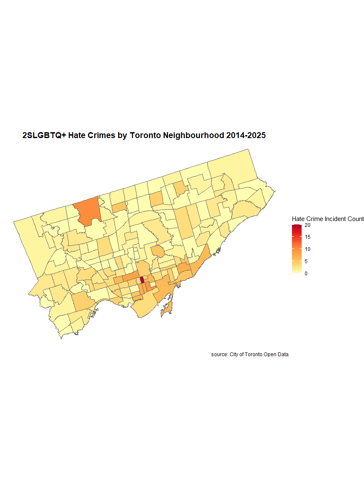

Data Visulization 1
================
Colin Li

# load packages and data

``` r
library(sf)
```

    ## Warning: package 'sf' was built under R version 4.3.3

    ## Linking to GEOS 3.11.2, GDAL 3.8.2, PROJ 9.3.1; sf_use_s2() is TRUE

``` r
library(ggplot2)
library(dplyr)
```

    ## 
    ## Attaching package: 'dplyr'

    ## The following objects are masked from 'package:stats':
    ## 
    ##     filter, lag

    ## The following objects are masked from 'package:base':
    ## 
    ##     intersect, setdiff, setequal, union

``` r
library(readr)
library(readxl)
```

    ## Warning: package 'readxl' was built under R version 4.3.3

``` r
#toronto.crime: https://open.toronto.ca/dataset/hate-crimes-open-data/
#geographical data: https://open.toronto.ca/dataset/neighbourhoods/

data <- read.csv("c:/Users/Colin/Downloads/toronto.crime.csv")
```

# select target variables

``` r
# our goal here is to count how many incidents in each neighborhood


target_values <- c(
  "2Slgbtq+",
  "2SLGBTQ+",
  "Gay",
  "Lesbian",
  "Lesbian, 2SLGBTQ+")

counts <- data %>%
  filter(SEXUAL_ORIENTATION_BIAS %in% target_values) %>%
  group_by(NEIGHBOURHOOD_158) %>%
  summarise(match_count = n(), .groups = "drop")
```

# merge data

``` r
# here we need to merge the hate crime data with the geogrphical data so we can plot the map and boundaries
boundaries <- st_read("c:/Users/Colin/Downloads/Neighbourhoods.geojson", quiet = TRUE)

counts$area <- counts$NEIGHBOURHOOD_158
boundaries$area <- boundaries$AREA_DESC

merged <- boundaries %>%
  left_join(counts, by = "area") %>%
  mutate(match_count = ifelse(is.na(match_count), 0, match_count))
```

# static graph

``` r
merged$hover_text <- paste0(
  merged$area, "<br>Count: ", merged$match_count
)

p <- ggplot(merged) +
  geom_sf(aes(fill = match_count, text = hover_text), color = "grey40", linewidth = 0.2) +
  scale_fill_distiller(
    palette = "YlOrRd",
    direction = 1,
    name = "Hate Crime Incident Count"
  ) +
  labs(title = "2SLGBTQ+ Hate Crimes by Toronto Neighbourhood 2014-2025", caption = "source: City of Toronto Open Data") +
  theme_void() +
  theme(
    plot.title = element_text(hjust = 0.5, size = 14, face = "bold"),
    legend.position = "right"
  )
```

    ## Warning in layer_sf(geom = GeomSf, data = data, mapping = mapping, stat = stat,
    ## : Ignoring unknown aesthetics: text

``` r
print(p)
```

<!-- -->

# interactive graph

``` r
# making this so we can see the neighbourhood name at the same time

#library(plotly)
#ggplotly(p, tooltip = "text")
```
